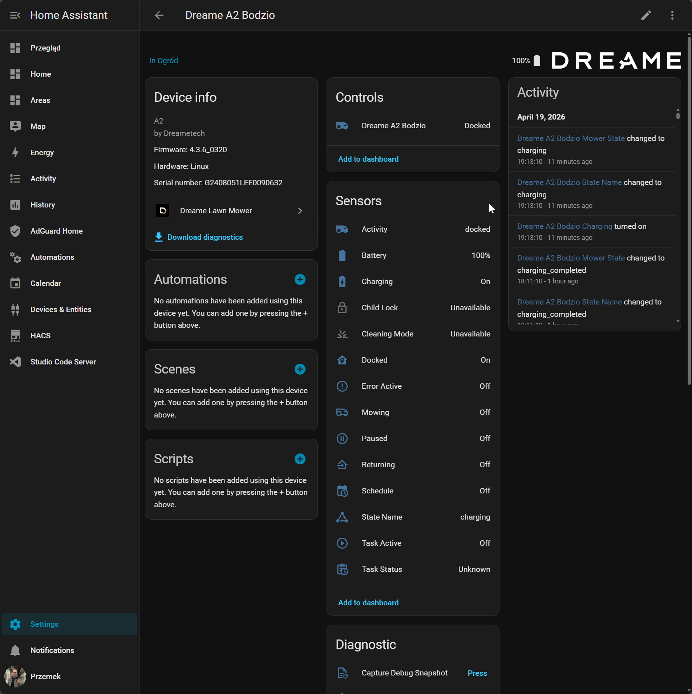
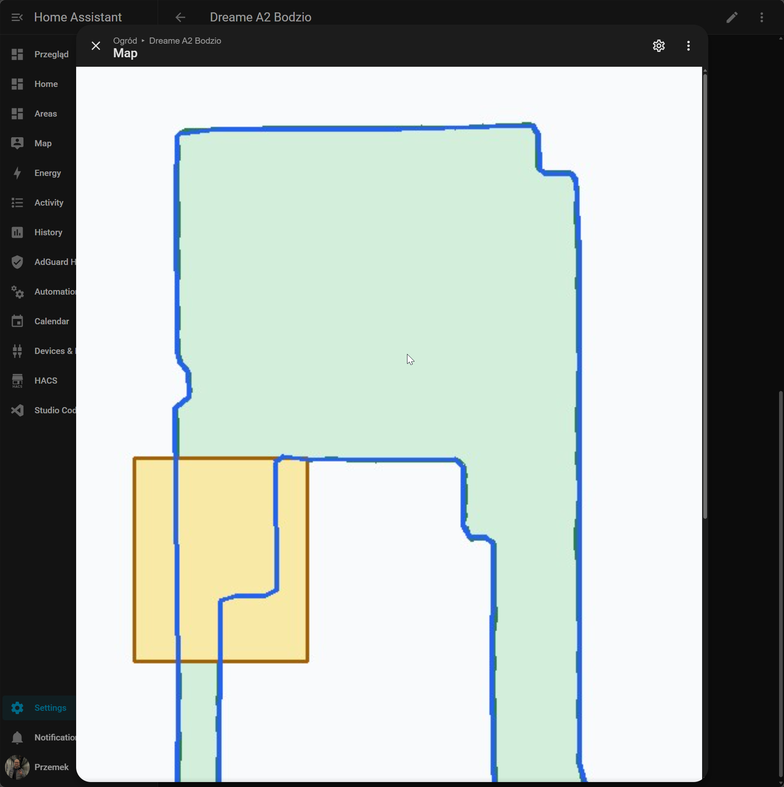
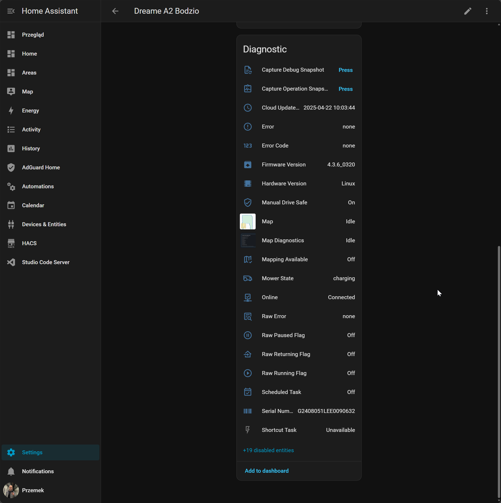

# Dreame Lawn Mower for Home Assistant

[](https://hacs.xyz/)
[](https://github.com/EvotecIT/homeassistant-dreamelawnmower/actions/workflows/validate.yml)
[](https://github.com/EvotecIT/homeassistant-dreamelawnmower/actions/workflows/hassfest.yml)
[](LICENSE)

Custom Home Assistant integration for Dreame and MOVA robotic lawn mowers.

The integration uses the cloud/app protocol exposed by Dreamehome and MOVAhome.
It is being developed against real A2-family hardware and is intentionally
conservative with anything that can move the mower or change mower settings.



## Screenshots





## Status

This project is usable, but still young. Core mower state, controls, schedules,
maps, and diagnostics are available. Some features remain diagnostic or
disabled by default while the protocol is validated across more models.

## Support Matrix

Support levels in this table mean:

- `Validated`: exercised against real hardware and fixtures in this repository
- `Recognized`: model strings, account types, or rebadges are known and should
  degrade gracefully, but still need more real-world confirmation
- `Needs reports`: intended target, but not yet proven enough to claim support

| Scope | Status | Notes |
| --- | --- | --- |
| Dreame A2 (`dreame.mower.g2408`) | Validated | Primary live development device, including schedules, maps, remote control, and diagnostics |
| Newer A-series mower (`dreame.mower.g3255`) | Recognized | Raw model has been observed in code mapping, but the public retail name is still unverified |
| Dreame A1 (`dreame.mower.p2255`) | Recognized | Model mapping is present; needs fixtures and live validation |
| Dreame A1 Pro (`dreame.mower.g2422`) | Recognized | Model mapping is present; needs fixtures and live validation |
| MOVAhome accounts | Recognized | Login flow and account type are supported; needs broader live confirmation |
| MOVA-branded mower rebadges | Needs reports | Expected to follow the same protocol family, but still needs sanitized fixtures and user reports |
| Regional / firmware variants of known A-series models | Needs reports | Should avoid crashing, but behavior can still vary by firmware and region |

Current live validation is still centered on:

- Dreamehome account in the EU region
- A2-family hardware

If you have a mower model not listed as `Validated`, please open an issue or PR.
Model reports with sanitized diagnostics, screenshots, raw model identifiers, and
region/account details are especially helpful for moving a device from
`Recognized` or `Needs reports` to `Validated`.

## Features

- UI config flow with Dreamehome or MOVAhome account login
- automatic mower discovery from the cloud account
- `lawn_mower` entity for start, pause, and dock
- battery, activity, state, task, firmware, and error sensors
- current-map selector entities for map, mowing action, edge, zone, and spot scope
- current-map services for switching maps and starting explicit zone, spot, or edge runs
- binary sensors for docked, charging, mowing, paused, returning, and error state
- binary sensor for Bluetooth-connected runtime state
- read-only schedule calendar using the mower-native app schedule protocol
- disabled-by-default all-schedules calendar for default and per-map schedule diagnosis
- guarded schedule enable/disable service with dry-run mode by default
- guarded mowing-preference update service with dry-run mode by default
- read-only map camera using the app-map payload when available
- disabled-by-default all-maps and map-diagnostics cameras
- runtime telemetry sensors for mission progress, mission area, mower pose, and live-track length
- selected-run sensors for mowing action, chosen map, and scoped zone/spot/edge target
- selected-zone preference sensors for read-only mowing height, efficiency, direction, and obstacle-avoidance details
- read-only weather/rain-protection diagnostics
- read-only weather/rain-protection entities from cached app settings
- read-only mowing-preference diagnostics
- supervised remote-control service for short validation pulses
- sanitized diagnostics and debug snapshot helpers

## Not Yet Public-Ready Features

The following areas are intentionally cautious:

- firmware OTA availability is reported as unknown unless a verified mower OTA
  signal is found
- rain-protection writes are not exposed yet
- mowing-preference writes are guarded and still need broader model and firmware validation
- map rendering is read-only; no-go editing, virtual-wall editing, and other map
  editing flows are not exposed yet
- camera/photo/video paths are probe-only until runtime safety is clearer
- 3D map object downloads are metadata-first and not treated as stable
- manual driving must stay supervised and uses strict state and battery guards

## Installation

### HACS

1. Open HACS.
2. Add this repository as a custom integration repository.
3. Install **Dreame Lawn Mower**.
4. Restart Home Assistant.
5. Add the integration from **Settings -> Devices & services**.

### Manual

Copy `custom_components/dreame_lawn_mower` into your Home Assistant
`custom_components` directory, restart Home Assistant, then add the integration
from the UI.

## Configuration

The config flow asks for:

- account type: `dreame` or `mova`
- country/region
- username
- password

The integration stores Home Assistant config-entry data only. Do not put
credentials into repository files, fixtures, or issue attachments.

## Help Expand Support

Support across Dreame, MOVA, and rebadged mower variants will improve fastest
with real-world reports. If your mower is recognized but not yet validated, or
if it exposes a different raw model string than this README shows, please open a
GitHub issue or PR with:

- the retail product name and raw app/cloud model identifier
- account type (`dreame` or `mova`) and region
- a sanitized diagnostics capture or Home Assistant debug snapshot
- screenshots of the product page, app model name, or device information page
- notes about what works, what is missing, and any errors you see

Please redact credentials, tokens, serial numbers, exact coordinates, and any
other secrets before attaching files.

## Entities

The primary entity is:

- `lawn_mower.<device>`

Common user-facing helpers include:

- `sensor.<device>_activity`
- `sensor.<device>_state_name`
- `sensor.<device>_error`
- `sensor.<device>_battery`
- `sensor.<device>_mowing_progress`
- `sensor.<device>_selected_mowing_action`
- `sensor.<device>_selected_map`
- `sensor.<device>_selected_target`
- `sensor.<device>_selected_zone_mowing_height`
- `sensor.<device>_selected_zone_efficiency_mode`
- `sensor.<device>_selected_zone_direction_mode`
- `sensor.<device>_selected_zone_obstacle_avoidance`
- `sensor.<device>_selected_zone_obstacle_distance`
- `sensor.<device>_selected_zone_obstacle_height`
- `sensor.<device>_selected_zone_obstacle_classes`
- `sensor.<device>_runtime_mission_progress`
- `sensor.<device>_runtime_current_area`
- `sensor.<device>_runtime_total_area`
- `sensor.<device>_runtime_live_track_length`
- `sensor.<device>_runtime_live_track_point_count`
- `sensor.<device>_weather_protection_status`
- `select.<device>_map`
- `select.<device>_mowing_action`
- `select.<device>_edge`
- `select.<device>_zone`
- `select.<device>_spot`
- `binary_sensor.<device>_docked`
- `binary_sensor.<device>_charging`
- `binary_sensor.<device>_bluetooth_connected`
- `binary_sensor.<device>_mowing`
- `binary_sensor.<device>_rain_delay_active`
- `binary_sensor.<device>_returning`
- `calendar.<device>_schedule`

Many reverse-engineering and validation helpers are disabled by default. Enable
them from the entity registry only when troubleshooting:

- map and all-map cameras
- map diagnostics camera
- runtime pose / heading / segment-count sensors
- all-schedules calendar
- rain delay end time sensor
- last schedule probe/write sensors
- last task-status, weather, and preference probe sensors
- raw vendor flag sensors
- manual-drive safety diagnostics

## Schedules And Multiple Maps

Dreame A2 schedules can exist in more than one slot. Live captures have shown a
default schedule plus per-map schedules. The normal Home Assistant `Schedule`
calendar follows the active schedule version reported by the mower's `SCHDT`
response, so hidden/default/other-map schedules do not appear as normal mowing
events.

Enable the disabled `All Schedules` calendar only when you intentionally want to
inspect every decoded schedule slot.

The guarded `dreame_lawn_mower.set_schedule_plan_enabled` service is dry-run
first. It sends a write only when both `execute: true` and
`confirm_schedule_write: true` are set.

`dreame_lawn_mower.plan_mowing_preference_update` is dry-run first. It reads
the current app preference payload, applies the requested field changes
locally, and exposes the candidate `PRE` request in a notification plus the
disabled-by-default `Last Preference Write` diagnostic sensor. It sends a live
preference write only when both `execute: true` and
`confirm_preference_write: true` are provided.

## Maps

The map camera uses the confirmed app-map JSON path first. The renderer is
read-only and produces a simple Home Assistant camera image from the decoded map
payload.

If the mower has multiple maps, enable the disabled `All Maps` camera to render
a contact sheet. Use `Map Diagnostics` when the map image is missing or when you
need source, counts, and parser evidence.

Current map support now includes:

- a read-only `Map` camera for the active map
- a read-only `All Maps` contact sheet for quick map inventory
- `select` entities for map, mowing action, edge, zone, and spot scope
- services for switching the active mower map and starting explicit zone, spot,
  or edge jobs
- runtime live-track telemetry surfaced through sensors and map-camera attributes

Interactive map editing is still intentionally out of scope for now:

- no-go editing
- virtual-wall editing
- zone geometry edits
- other direct map mutations

## Services

The integration now exposes guarded current-map services on the `lawn_mower`
entity:

- `dreame_lawn_mower.switch_current_map`
- `dreame_lawn_mower.start_zone_mowing`
- `dreame_lawn_mower.start_spot_mowing`
- `dreame_lawn_mower.start_edge_mowing`

These use current decoded app-map and vector-map metadata. Map switching updates
the real active mower map, while zone, spot, and edge starts target explicit
current-map ids rather than relying only on the generic Home Assistant
`start_mowing` action.

## Troubleshooting

Start with Home Assistant diagnostics:

1. Open the device page.
2. Download diagnostics.
3. Check the `triage`, `state_reconciliation`, schedule, and map sections.

For issue reports, include:

- mower model and app/account type
- firmware version
- normalized activity/state/error values
- relevant diagnostic payload sections with secrets redacted
- whether the issue happens while docked, mowing, returning, raining, or charging

Home Assistant log lines that start with `Captured Dreame lawn mower ...` can be
converted to JSON with:

```bash
python examples/extract_ha_payload.py home-assistant.log --summary
```

## Reusable Python Package

This repository ships two usable layers:

- `dreame_lawn_mower_client` for direct Python access to Dreame/MOVA mower
  cloud, app-action, schedule, map, and diagnostic APIs
- the Home Assistant integration in `custom_components/dreame_lawn_mower`

Library docs: [docs/python-library.md](docs/python-library.md)

Runnable example: [examples/python_client.py](examples/python_client.py)

Example:

```python
from dreame_lawn_mower_client import DreameLawnMowerClient

devices = await DreameLawnMowerClient.async_discover_devices(
    username=username,
    password=password,
    country="eu",
    account_type="dreame",
)

client = DreameLawnMowerClient(
    username=username,
    password=password,
    country="eu",
    account_type="dreame",
    descriptor=devices[0],
)
snapshot = await client.async_refresh()
print(snapshot.descriptor.title, snapshot.state_name, snapshot.battery_level)
```

The Home Assistant integration uses the same client package name inside the
custom component bundle, so HACS installs the protocol layer together with the
integration while scripts and tests can still import `dreame_lawn_mower_client`
directly.

## Development

Install development dependencies:

```bash
python -m pip install -e .[test]
```

Run checks:

```bash
python -m compileall dreame_lawn_mower_client custom_components tests examples
pytest
```

Useful docs:

- [Python library](docs/python-library.md)
- [Development notes](docs/development.md)
- [Roadmap](docs/roadmap.md)
- [Dreamehome protocol research](docs/dreamehome-research.md)
- [Agent handoff notes](docs/agent-handoff.md)

## Safety

Read-only probes are preferred. Anything that can move the mower or write mower
settings must remain supervised, explicitly confirmed, and safe-state guarded.
