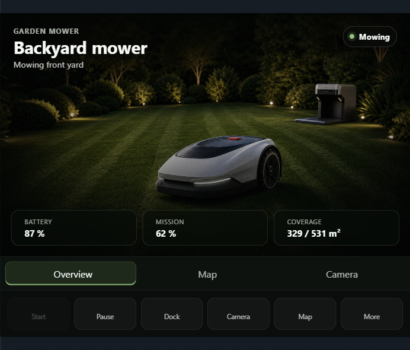
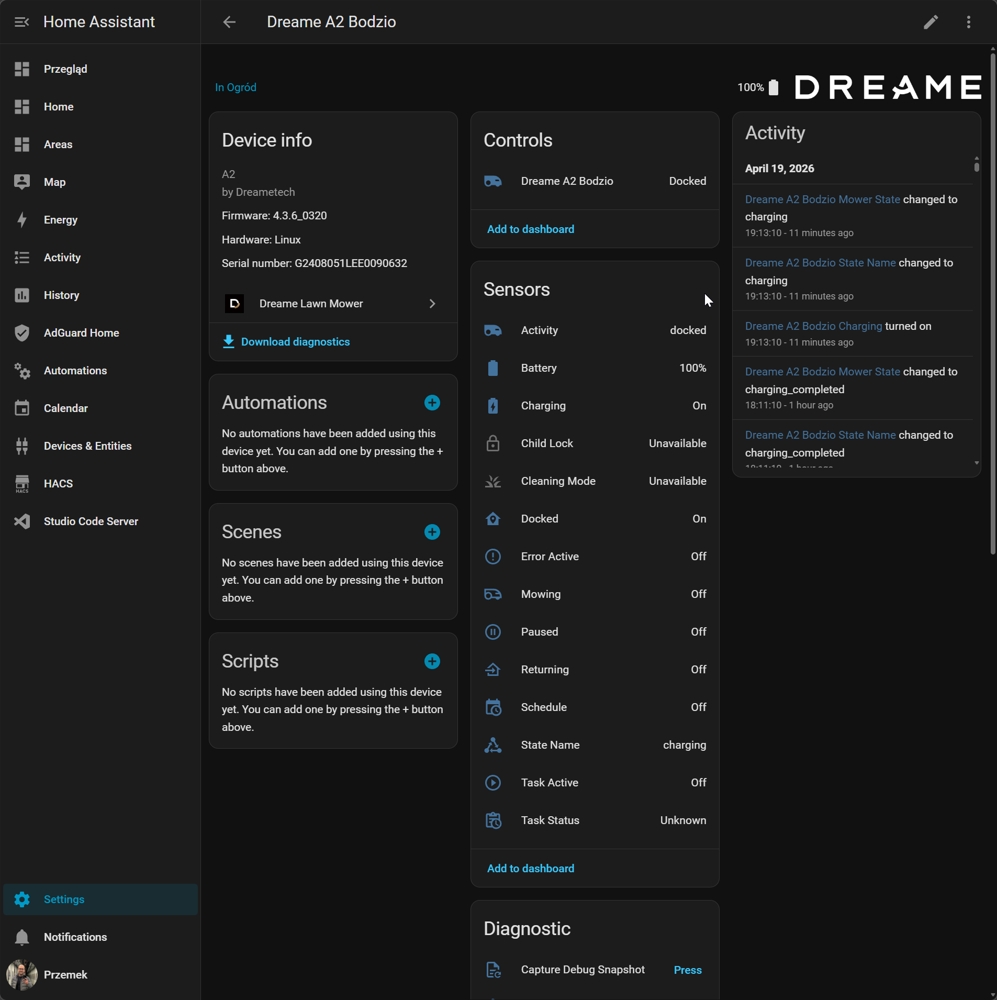

# Dreame Lawn Mower for Home Assistant

[](https://hacs.xyz/)
[](https://github.com/EvotecIT/homeassistant-dreamelawnmower/actions/workflows/validate.yml)
[](https://github.com/EvotecIT/homeassistant-dreamelawnmower/actions/workflows/hassfest.yml)
[](LICENSE)

Bring a Dreame or MOVA robotic mower into Home Assistant with mower-native
controls, schedules, maps, live coverage, and camera support.



The integration follows the Dreamehome and MOVAhome app protocol and is tested
against real A2-family hardware. Everyday state and controls stay simple, while
reverse-engineering probes and riskier maintenance operations remain out of the
default dashboard.

For the dashboard shown above, pair this integration with the
[Lawn Mower Card](https://github.com/EvotecIT/lovelace-lawn-mower-card). Its Hero
layout automatically finds the integration's map, mission, coverage, and live
video entities when their names follow the normal Home Assistant device naming.

## 🧩 More from Evotec

Our Home Assistant projects:

- [Dreame Lawn Mower](https://github.com/EvotecIT/homeassistant-dreamelawnmower)
  with its companion
  [Lawn Mower Card](https://github.com/EvotecIT/lovelace-lawn-mower-card)
- [Siegenia](https://github.com/EvotecIT/homeassistant-siegenia) for local
  window control
- [KEF](https://github.com/EvotecIT/homeassistant-kef) for local speaker control
- [Devialet](https://github.com/EvotecIT/homeassistant-devialet) for local
  speaker control
- [EasyControlX](https://github.com/EvotecIT/homeassistant-easycontrolx) for
  workstation control

Our Apple apps:

- [CasaRay](https://casaray.dev/) offers a calm whole-home view on iPhone, iPad,
  and Mac. [View it on the App Store](https://apps.apple.com/us/app/casaray/id6778025328).
- [Tactra Remote](https://tactra.dev/) focuses on Home Assistant media control
  across iPhone, iPad, Apple Watch, and Mac.
  [View it on the App Store](https://apps.apple.com/us/app/tactra-remote/id6775426723).

CasaRay's complete-home Free experience remains genuinely useful. CasaRay Plus
and Tactra purchases help fund continued work on that free experience and these
open-source Home Assistant projects. If you prefer to support the open-source
work directly, [GitHub Sponsors](https://github.com/sponsors/PrzemyslawKlys) is
another option. None of them is required to use this project.

## See It In Action

The live-path map combines the stored garden geometry with mower position and
the current cut trail. The card warms this image while the Overview tab is open,
so switching to Map does not have to begin with a blank frame.


The standard Home Assistant device page remains available for entity discovery
and diagnostics:



## Status

This project is usable, but still young. Core mower state, controls, schedules,
maps, and diagnostics are available. Some features remain diagnostic or
disabled by default while the protocol is validated across more models.

## Support Matrix

Support levels in this table mean:

- `Validated`: exercised against real hardware and fixtures in this repository
- `Recognized`: model strings, account types, or rebadges are known and should
  degrade gracefully, but still need more real-world confirmation
- `Needs reports`: intended target, but not yet proven enough to claim support

| Scope | Status | Notes |
| --- | --- | --- |
| Dreame A2 (`dreame.mower.g2408`) | Validated | Primary live development device, including schedules, maps, remote control, guarded preference writes, and diagnostics |
| MOVA LiDAX Ultra 1000 (`mova.mower.g2529c`) | Recognized | Added from a MOVAhome EU diagnostics report; commands and battery are reported working, state handling now accepts model-specific cloud property ids |
| Dreame A3 AWD Pro 3500 (`dreame.mower.g2541e`) | Recognized | Added from a Dreamehome EU diagnostics report; needs broader live confirmation before it is considered validated |
| Dreame A3 AWD 1000 (`dreame.mower.q2501a`) | Validated | Core entities, maps, mower state, and cloud live video are field-confirmed on firmware `4.3.6_0418`; video worked after the same mower was bound to an EU account, while its previous RU account lacked the required cloud video identity |
| Newer A-series mower (`dreame.mower.g3255`) | Recognized | Raw model has been observed in code mapping, but the public retail name is still unverified |
| Dreame A1 (`dreame.mower.p2255`) | Recognized | Model mapping is present; needs fixtures and live validation |
| Dreame A1 Pro (`dreame.mower.g2422`) | Recognized | Model mapping is present; needs fixtures and live validation |
| MOVAhome accounts | Recognized | Login flow and account type are supported; needs broader live confirmation |
| MOVA-branded mower rebadges | Needs reports | Expected to follow the same protocol family, but still needs sanitized fixtures and user reports |
| Regional / firmware variants of known A-series models | Needs reports | Should avoid crashing, but behavior can still vary by firmware and region |

Current live validation is still centered on:

- Dreamehome account in the EU region
- A2-family hardware

If you have a mower model not listed as `Validated`, please open an issue or PR.
Model reports with sanitized diagnostics, screenshots, raw model identifiers, and
region/account details are especially helpful for moving a device from
`Recognized` or `Needs reports` to `Validated`.

## Features

- UI config flow with Dreamehome or MOVAhome account login
- automatic mower discovery from the cloud account
- `lawn_mower` entity for start, pause, and dock
- button to dock without ending the current mowing session
- heartbeat-backed task status and automatic resume of a paused mowing session
- battery, activity, state, task, firmware, and error sensors
- active-map selector that switches the mower, plus mowing action, edge, zone,
  and spot selectors that follow the selected map
- maintenance-point selector and action button for maps where a maintenance
  point has been configured in the mower app
- current-map services for switching maps and starting explicit zone, spot, or edge runs
- binary sensors for docked, charging, mowing, paused, returning, and error state
- binary sensors for active and resumable mowing sessions
- binary sensor for Bluetooth-connected runtime state
- read-only schedule calendar using the mower-native app schedule protocol
- standard per-plan schedule switches for direct dashboard and automation use
- disabled-by-default all-schedules calendar for default and per-map schedule diagnosis
- guarded schedule enable/disable service with dry-run mode by default
- guarded mowing-preference update service with dry-run mode by default
- self-refreshing map cameras with live session overlays, Unicode labels,
  coordinated light/dark themes, line and marker scaling, and per-map rotation
- optional custom mower marker loaded only from Home Assistant's `config/www`
  folder, with path, type, size, and image-dimension limits
- on-demand PCD point-cloud generation through an authenticated, admin-only
  Home Assistant download endpoint
- disabled-by-default all-maps and map-diagnostics cameras
- live video camera with a managed XP2P runtime on Linux x86_64 and aarch64 hosts
- runtime telemetry sensors for mission progress, mission area, mower pose, and live-track length
- last-session mission progress and coverage retained after docking, explicitly
  marked with `cached: true` and a `captured_at` timestamp
- selected-run sensors for mowing action, chosen map, and scoped zone/spot/edge target
- selected-zone preference sensors for mowing height, efficiency, direction, and obstacle-avoidance details
- standard Home Assistant controls for global/custom preference mode, global
  and selected-zone cutting height, mowing efficiency, edge behavior, and
  obstacle avoidance
- read-only weather/rain-protection diagnostics
- read-only weather/rain-protection entities from cached app settings
- read-only mowing-preference diagnostics
- supervised remote-control service for short validation pulses
- sanitized diagnostics and debug snapshot helpers
- cloud presence checks that make entities unavailable instead of showing stale
  mower values while the device is offline

## Not Yet Public-Ready Features

The following areas are intentionally cautious:

- firmware OTA now exposes a Home Assistant update entity using the app's
  approved `checkDeviceVersion` target and `manualFirmwareUpdate` approval
  step, but release notes remain best-effort because the live A2 endpoint still
  embeds a `missing lang` error string in the changelog field
  the live Dreame A2 verification on April 22, 2026 completed from
  `4.3.6_0320` to `4.3.6_0447`
- a read-only debug OTA catalog probe exists for version-trace work, but it is
  not treated as authoritative latest-version, changelog, or install approval
  data because it is a manual catalog rather than the mobile app's approved OTA
  response
- firmware diagnostics now include those debug-catalog candidate versions when
  available, so operation snapshots can show plausible newer builds without
  conflating them with the app-approved update target
- rain-protection writes are not exposed yet
- mowing-preference writes are validated on a supervised A2 no-op write and
  still need broader model and firmware validation
- map rendering is read-only; no-go editing, virtual-wall editing, and other map
  editing flows are not exposed yet
- live video has been validated end to end on a Dreame A2 and on an A3 AWD 1000
  (`dreame.mower.q2501a`, firmware `4.3.6_0418`) using an EU account; other
  Tencent-video mower models and firmware still need field validation
- the managed video runtime currently supports Linux x86_64 and aarch64 Home
  Assistant hosts, and the mower must be active and away from its station before
  the vendor permits live video
- 3D point-cloud generation and PCD download are validated on the Dreame A2;
  other mower families still need field reports
- manual driving must stay supervised and uses strict state and battery guards

## Installation

### HACS

1. Add this repository to HACS as a custom integration repository:

   [](https://my.home-assistant.io/redirect/hacs_repository/?owner=EvotecIT&repository=homeassistant-dreamelawnmower&category=integration)

   If the button does not open your Home Assistant instance, manually add this
   repository URL in HACS:

   `https://github.com/EvotecIT/homeassistant-dreamelawnmower`

2. Install **Dreame Lawn Mower** from HACS.
3. Restart Home Assistant.
4. Add the integration from **Settings -> Devices & services**:

   [](https://my.home-assistant.io/redirect/config_flow_start/?domain=dreame_lawn_mower)

### Manual

Copy `custom_components/dreame_lawn_mower` into your Home Assistant
`custom_components` directory, restart Home Assistant, then add the integration
from the UI.

## Configuration

The config flow asks for:

- account type: `dreame` or `mova`
- country/region
- username
- password

The integration stores Home Assistant config-entry data only. Do not put
credentials into repository files, fixtures, or issue attachments.

### Live video

On Linux x86_64 and aarch64 Home Assistant hosts, the `Live Video` camera uses
the managed runtime by default. No Android phone, emulator, library path, or
external runner is required. The integration prepares the runtime during entity
setup, starts it when Home Assistant requests the camera, verifies the local FLV
source, and stops it when the camera is turned off or unloaded.

The first setup needs internet access. The integration downloads fixed versions
of Tencent XP2P, the required AOSP Bionic libraries, and qemu-user-static on
x86_64 hosts. Every file is pinned and SHA-256 verified before use, then cached
under Home Assistant's `.storage` directory. The Home Assistant/Python client
owns the lifecycle; Tencent's proprietary P2P transport still runs in the small
native compatibility worker. It does not require an Android device or Android
framework.

The Dreame A2 proof uses a normal copied `custom_components` installation, the
real Home Assistant mower and camera entities, and Home Assistant's HLS output.
The retained H.264 MP4 reopened independently as 640 x 360 video and decoded
100 frames spanning 6.599 seconds. The HA camera entity also returned a real
JPEG through the integration's PyAV/Pillow still-image path, even without the
optional TurboJPEG system library, and that frame was visually inspected. This
is a pixel-level playback proof, not only an FLV header or byte-count check.

The mower vendor only allows video while the mower is active and away from its
station. Requesting the camera does not start or move the mower. The existing
native-library and persistent-runner options remain available as advanced
overrides for development or unsupported host platforms.

On the field-tested A3 AWD 1000, XP2P negotiation takes about 30–40 seconds and
the media source supports one consumer at a time. Opening a still-image request
while the Home Assistant panel is already playing HLS can make that competing
request fail. A vendor-timed session can also finish normally and leave the
camera idle on its last frame; request **Stream** again to negotiate a new
session. These timings and limits are model/firmware observations, not promises
for every mower.

The integration exposes two video transport policies. The default uses the
proven cloud-provisioned XP2P path. `Auto` can restart from health-checked cached
provisioning and lets Tencent negotiate the available network route. It also
probes Tencent's separate same-LAN service when mower firmware advertises one.
The tested A2 production firmware does not advertise that service, so the
integration does not offer a LAN-only policy. The camera's
`last_stream_session` attribute reports `stream_route` as `direct` only when
the separate LAN service was selected; otherwise it stays `unknown`. Tencent's
misleadingly named `getStreamLinkMode` API returns a network/NAT-type bitmask,
exposed as `sdk_stream_network_type`, rather than a direct-versus-relay result.

After a successful cloud-provisioned stream, `Auto` privately caches the minimum
XP2P identity, P2P material, QCloud/app credentials, and resolved device
configuration under Home Assistant's `.storage`. The cache uses Home Assistant's
private-store permissions and deliberately excludes the Dreame access token,
LAN discovery token, and raw cloud responses. On a later restart, `Auto` tries
that cache before any Dreame video-input or camera-toggle call and refreshes it
through the normal path if the cached material has expired.

This proof is intentionally narrower than every camera feature in the vendor
apps:

- In one captured A2 session, normal-XP2P AUTO media travelled directly between
  the Home Assistant host and the mower's same-LAN IP. A retained socket trace
  includes the direct peer address, FLV request, HTTP 200 response, and media
  bytes, so this does not depend on an SDK label. Tencent's separate WLAN
  discovery and `startLanService` path was also implemented, but this A2
  firmware did not answer that discovery request. Dreame/Tencent cloud calls
  still provide the
  initial provisioning. `Auto` can reuse health-checked video provisioning
  without fetching new video inputs or toggling the camera through Dreame cloud,
  but it first refreshes the mower snapshot and refuses to start when current
  safety state cannot be verified. Tencent XP2P can also use its internet
  rendezvous/STUN control plane to establish the direct peer route. Neither
  transport policy promises startup with all internet connectivity removed.
- Home Assistant can display and save the current JPEG frame, but the vendor's
  stored photo gallery is not exposed.
- Live video is field-validated on the A2 and A3 AWD 1000. A3 AWD Pro and MOVA
  camera variants still need their own runtime-input and playback proof.
- Patrol movement, arbitrary voice-prompt playback, and two-way live talk are
  separate control/audio features and are not implemented by this camera.

Maintainers can find the confirmed protocol split, A2 findings, retained LAN
implementation, and future device validation checklist in
[Video Transport and Same-LAN Research](docs/video-transport.md).

## Help Expand Support

Support across Dreame, MOVA, and rebadged mower variants will improve fastest
with real-world reports. If your mower is recognized but not yet validated, or
if it exposes a different raw model string than this README shows, please open a
GitHub issue or PR with:

- the retail product name and raw app/cloud model identifier
- account type (`dreame` or `mova`) and region
- a sanitized diagnostics capture or Home Assistant debug snapshot
- screenshots of the product page, app model name, or device information page
- notes about what works, what is missing, and any errors you see

Please redact credentials, tokens, serial numbers, exact coordinates, and any
other secrets before attaching files.

## Entities

The primary entity is:

- `lawn_mower.<device>`

Common user-facing helpers include:

- `sensor.<device>_activity`
- `sensor.<device>_state_name`
- `sensor.<device>_error`
- `sensor.<device>_battery`
- `sensor.<device>_mowing_progress`
- `sensor.<device>_selected_mowing_action`
- `sensor.<device>_selected_map`
- `sensor.<device>_selected_target`
- `sensor.<device>_selected_zone_mowing_height`
- `sensor.<device>_selected_zone_efficiency_mode`
- `sensor.<device>_selected_zone_direction_mode`
- `sensor.<device>_selected_zone_obstacle_avoidance`
- `sensor.<device>_selected_zone_obstacle_distance`
- `sensor.<device>_selected_zone_obstacle_height`
- `sensor.<device>_selected_zone_obstacle_classes`
- `sensor.<device>_runtime_mission_progress`
- `sensor.<device>_runtime_current_area`
- `sensor.<device>_runtime_total_area`
- `sensor.<device>_runtime_live_track_length`
- `sensor.<device>_runtime_live_track_point_count`
- `sensor.<device>_weather_protection_status`
- `select.<device>_map`
- `select.<device>_mowing_action`
- `select.<device>_edge`
- `select.<device>_zone`
- `select.<device>_spot`
- `binary_sensor.<device>_docked`
- `binary_sensor.<device>_charging`
- `binary_sensor.<device>_bluetooth_connected`
- `binary_sensor.<device>_mowing`
- `binary_sensor.<device>_task_active`
- `binary_sensor.<device>_task_resumable`
- `binary_sensor.<device>_rain_delay_active`
- `binary_sensor.<device>_returning`
- `calendar.<device>_schedule`
- `camera.<device>_live_video` on supported Linux hosts

Many reverse-engineering and validation helpers are disabled by default. Enable
them from the entity registry only when troubleshooting:

- map and all-map cameras
- map diagnostics camera
- runtime pose / heading / segment-count sensors
- all-schedules calendar
- rain delay end time sensor
- last schedule probe/write sensors
- last task-status, weather, and preference probe sensors
- raw vendor flag sensors
- manual-drive safety diagnostics

## Schedules And Multiple Maps

Dreame A2 schedules can exist in more than one slot. Live captures have shown a
default schedule plus per-map schedules. The normal Home Assistant `Schedule`
calendar follows the active schedule version reported by the mower's `SCHDT`
response, so hidden/default/other-map schedules do not appear as normal mowing
events.

Enable the disabled `All Schedules` calendar only when you intentionally want to
inspect every decoded schedule slot.

Each decoded plan is also exposed as a normal Home Assistant switch. Turning a
plan on or off uses the mower-native schedule write, then reads the schedules
again before updating the entity. These switches are suitable for dashboards,
automations, and voice assistants; no service flags are needed for an ordinary
switch action.

The guarded `dreame_lawn_mower.set_schedule_plan_enabled` service is dry-run
first. It sends a write only when both `execute: true` and
`confirm_schedule_write: true` are set.

`dreame_lawn_mower.plan_mowing_preference_update` is dry-run first. It reads
the current app preference payload, applies the requested field changes
locally, and exposes the candidate `PRE` request in a notification plus the
disabled-by-default `Last Preference Write` diagnostic sensor. It sends a live
preference write only when both `execute: true` and
`confirm_preference_write: true` are provided.

The guarded preference fields include per-zone safe edge mowing through
`edge_mowing_safe`. Use the dry-run result to inspect the candidate payload
before confirming a live write.

For normal dashboard and automation use, the integration also exposes:

- **Selected Map Preference Mode**, a `select` entity with `Global` and
  `Custom` options
- **Selected Map Mowing Height**, available while the selected map uses
  `Global` preferences
- **Selected Zone Mowing Height**, available while the selected map uses
  `Custom` preferences
- selects for mowing efficiency, obstacle height and distance, and edge-cutting
  style
- switches for automatic and safe edge cutting, edge obstacle avoidance, lidar
  obstacle recognition, and the people, animal, and object recognition classes

The cutting-height controls use 0.5 cm steps. A2 and other standard mower
families expose 3-7 cm; verified AWD families expose 3-10 cm. Every other
preference control follows the current `Global` record or the zone chosen by
the normal map and zone selectors, so a dashboard never presents a zone value
as if it were a whole-lawn setting. These standard entities work with Home
Assistant dashboards, automations, voice assistants, and the companion Lawn
Mower Card. The guarded service remains available when you need to inspect the
complete candidate preference payload before sending it.

## Maps

The map camera uses the confirmed app-map JSON path first and falls back to the
vector source when it carries the active session. Both renderers use the same
palette, bundled Unicode font, path widths, and marker settings.

Enabled map cameras warm their first image in the background during entity
startup. While a mowing session is active, coordinator updates also refresh the
map source without waiting for a browser request. The camera still returns the
last good JPEG immediately while a refresh runs. Identical source images reuse
the existing JPEG conversion. This cache is intentionally in memory: a Home
Assistant restart rebuilds it from the mower rather than persisting garden
geometry to a second on-disk store.

Transient paths and positions are scoped to the selected map and mowing task.
Changing either clears the prior session trail. A mower position outside the
selected map boundary is retained in diagnostics but withheld from the image,
and persisted mower trail data is not presented as live while the session is
inactive.

Under **Settings → Devices & services → Dreame Lawn Mower → Configure**, choose
an Emerald, Dark, Midnight, or High contrast theme and adjust label, line, and
marker scale. Use **Selected Map Display Rotation** to store a different
rotation for each map. To use a custom mower marker, place a PNG, JPEG, or WebP
under `/config/www` and enter its relative path, such as
`mower/my-marker.png`. The integration ignores absolute paths, traversal,
unsupported types, files over 1 MB, and images larger than 512 by 512 pixels.

The runtime mission progress, current-area, and total-area sensors also retain
the latest useful session values after mowing stops. While mowing they represent
live telemetry; after docking their attributes include `cached: true` and
`captured_at`. They become live again as soon as a new runtime session reports
metrics. This keeps dashboards useful without presenting an old mower position
or trail as current.

If the mower has multiple maps, enable the disabled `All Maps` camera to render
a contact sheet. Use `Map Diagnostics` when the map image is missing or when you
need source, counts, and parser evidence.

The map camera also advertises a local `point_cloud_api_path` attribute. A
Home Assistant administrator can sign that path for a short-lived download.
The integration asks the mower to generate the selected app map, immediately
captures the transient object, validates the returned PCD file, and serves it
with `private, no-store` caching. Vendor filenames, cloud-signed URLs, and point
coordinates are never written to entity state or logs.

The companion
[Lawn Mower Card](https://github.com/EvotecIT/lovelace-lawn-mower-card) detects
this attribute and offers an on-demand 3D viewer. It does not generate or
download garden geometry during an ordinary dashboard render. Select the Hero
layout's **3D** tab or press **Load 3D map** in another layout when you want to
fetch it. Point-cloud access is currently restricted to Home Assistant admins.

Current map support now includes:

- a read-only `Map` camera for the active map
- a read-only `All Maps` contact sheet for quick map inventory
- a `Map` select that switches the mower's active map and refreshes the map,
  zone, spot, edge, and maintenance-point controls
- a `Selected Map Display Rotation` select that stores orientation per map
- `select` entities for mowing action, edge, zone, spot, and maintenance-point
  scope
- preference controls that follow either the selected map's global record or
  its selected custom zone
- a **Go to Maintenance Point** button when the selected map contains a point
  configured in the mower app
- services for switching the active mower map and starting explicit zone, spot,
  or edge jobs
- runtime live-track telemetry surfaced through sensors and map-camera attributes
- an admin-only, transient PCD point-cloud download for the selected app map
- circular and rotated rectangular forbidden areas rendered from their compact
  mower map representation

Interactive map editing is still intentionally out of scope for now:

- no-go editing
- virtual-wall editing
- zone geometry edits
- other direct map mutations

## Services

The integration now exposes guarded current-map services on the `lawn_mower`
entity:

- `dreame_lawn_mower.switch_current_map`
- `dreame_lawn_mower.start_zone_mowing`
- `dreame_lawn_mower.start_spot_mowing`
- `dreame_lawn_mower.start_edge_mowing`

These use current decoded app-map and vector-map metadata. Map switching updates
the real active mower map, while zone, spot, and edge starts target explicit
current-map ids rather than relying only on the generic Home Assistant
`start_mowing` action.

For example, this starts the saved zone with ID `1` on the mower's active map:

```yaml
action: dreame_lawn_mower.start_zone_mowing
target:
  entity_id: lawn_mower.a3_awd_pro_3500
data:
  zone_ids: [1]
```

Use `entity_id` when the value starts with `lawn_mower.`. A Home Assistant
`device_id` is a separate device-registry identifier and must not contain an
entity ID. The lawn mower entity exposes `available_zone_ids`, and zone selects
use names saved in the Dreame app when vector-map metadata provides them. An
unnamed zone retains the stable `Zone #<id>` fallback.

Zone, spot, and edge actions are acknowledged by the mower before Home
Assistant reports success. Unknown current-map IDs, map-scope mismatches, and
device rejection responses are surfaced as failed actions.

## Troubleshooting

Start with a fresh Home Assistant diagnostics capture:

1. Reproduce the problem once.
2. Before reloading or restarting Home Assistant, open the integration or device
   page and download diagnostics.
3. Attach the downloaded JSON to the issue. Add screenshots or short log excerpts
   only when they show something that is not already in the diagnostics.

The report is sanitized by the integration and includes:

- the installed integration, Home Assistant, Python, operating-system, and CPU
  architecture versions
- config-entry and coordinator health
- privacy-safe setup, foreground-refresh, and background-metadata timings,
  including bounded recent samples plus the latest and aggregate duration for
  each operation
- current state and diagnostic attributes for every entity belonging to the
  config entry, including the Live Video camera's last failure stage and a
  bounded, privacy-safe summary of each TX video cloud stage
- a bounded list of recent coordinator, map, schedule, and video failures with
  repeated failures coalesced
- the existing `triage`, `state_reconciliation`, schedule, map, firmware, and raw
  property summaries

Do not enable broad debug logging unless a maintainer asks for a specific logger.
Cloud protocol debug output can contain data that needs additional review before
it is posted publicly.

Startup and refresh measurements are also written as log lines beginning with
`Dreame mower performance`. The first setup and metadata hydration are logged at
info level, while unusually slow foreground or background refreshes are logged
as warnings. Each line reports only operation names and elapsed time; it does
not contain credentials, mower identifiers, map data, or coordinates.

For startup reports, include both the `setup` and `metadata_refresh` entries
from downloaded diagnostics. `setup` is the blocking Home Assistant load path.
`metadata_refresh` covers optional maps, schedules, firmware, weather,
maintenance, and preference metadata that continues in the background after
the mower entity can load. The per-phase timings show which vendor endpoint is
slow without requiring broad protocol debug logging.

The staged cloud summaries retain field names, value types, safe status codes,
required-field presence, and sanitized error messages. They do not retain raw
response values, account or device identifiers, credentials, stream URLs, or
unbounded payloads. This lets maintainers distinguish unsupported models,
malformed vendor responses, and missing provisioning without asking users to
share an account as the first debugging step.

### Live video identity is not provisioned

The integration reports `device_triple_missing` when both Dreame video identity
endpoints return vendor code `10000`, `设备三元组不存在` ("device triple does not
exist"), and the required `product_id`, `device_name`, and `p2p_info` fields are
absent. This means Dreame has not provisioned the mower's XP2P video identity
for the current account or region; it is not a video-runtime or model-support
failure.

Check live video in Dreamehome or MOVAhome first. If it is missing there too,
contact Dreame support and include the diagnostics capture. A field report for
an A3 AWD 1000 found this condition on an RU account and confirmed working video
after the same mower was rebound to an EU account. That is one account/device
result, not evidence that every device in a region behaves the same way.

Changing account region requires pairing the mower to another account and can
discard cloud-stored maps and settings. Treat that as a last resort, not the
normal fix for `device_triple_missing`.

For issue reports, include:

- the downloaded diagnostics captured immediately after the failure
- what you expected and the exact steps that failed
- whether the same operation worked in Dreamehome or MOVAhome at that time
- screenshots only when the visible result matters

Home Assistant log lines that start with `Captured Dreame lawn mower ...` can be
converted to JSON with:

```bash
python examples/extract_ha_payload.py home-assistant.log --summary
```

## Reusable Python Package

This repository ships two usable layers:

- `dreame_lawn_mower_client` for direct Python access to Dreame/MOVA mower
  cloud, app-action, schedule, map, and diagnostic APIs
- the Home Assistant integration in `custom_components/dreame_lawn_mower`

Library docs: [docs/python-library.md](docs/python-library.md)

Runnable example: [examples/python_client.py](examples/python_client.py)

Example:

```python
from dreame_lawn_mower_client import DreameLawnMowerClient

devices = await DreameLawnMowerClient.async_discover_devices(
    username=username,
    password=password,
    country="eu",
    account_type="dreame",
)

client = DreameLawnMowerClient(
    username=username,
    password=password,
    country="eu",
    account_type="dreame",
    descriptor=devices[0],
)
snapshot = await client.async_refresh()
print(snapshot.descriptor.title, snapshot.mower_state_name, snapshot.battery_level)
```

The Home Assistant integration uses the same client package name inside the
custom component bundle, so HACS installs the protocol layer together with the
integration while scripts and tests can still import `dreame_lawn_mower_client`
directly.

## Development

Install development dependencies:

```bash
python -m pip install -e .[test]
```

Run checks:

```bash
python -m compileall dreame_lawn_mower_client custom_components tests examples
pytest
```

Useful docs:

- [Python library](docs/python-library.md)
- [Development notes](docs/development.md)
- [Roadmap](docs/roadmap.md)
- [Dreamehome protocol research](docs/dreamehome-research.md)
- [Agent handoff notes](docs/agent-handoff.md)

## Safety

Read-only probes are preferred. Anything that can move the mower or write mower
settings must remain supervised, explicitly confirmed, and safe-state guarded.
