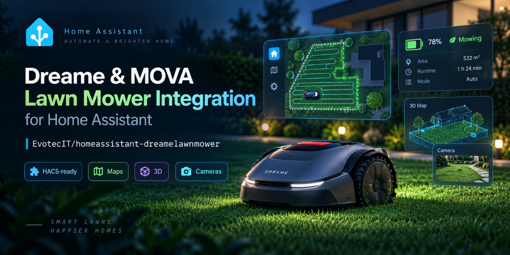

# Dreame & MOVA Lawn Mowers for Home Assistant

## Overview

Control and monitor Dreame and MOVA robotic lawn mowers through Home Assistant's
`lawn_mower` entity. Start, pause, and dock the mower, manage supported schedules
and mowing preferences, and add maps, mission progress, and camera views to your
dashboard.

- Mower state, battery, faults, rain protection, charging, and maintenance.
- Map selection and targeted zone, spot, or edge mowing.
- Native schedule switches, notifications, and automation helpers.
- Optional live video and on-demand 3D maps on supported mowers and hosts.

Check the [supported mower list](docs/supported-mowers.md) before installing.
Model, firmware, account region, and vendor provisioning affect advanced
features. Map routes show observed movement, not verified cut-area coverage.

## Sponsor

Support development and maintenance through
[GitHub Sponsors](https://github.com/sponsors/PrzemyslawKlys).
Sponsorship is optional; these projects remain open source.

## More for your Home Assistant home

Other integrations and dashboards we maintain:

- [Lawn Mower Card](https://github.com/EvotecIT/lovelace-lawn-mower-card) — A dashboard for mower state, maps, and controls.
- [KEF](https://github.com/EvotecIT/homeassistant-kef) — Local control for modern and legacy speaker families.
- [Devialet](https://github.com/EvotecIT/homeassistant-devialet) — Local speaker control, with Dione support.
- [Siegenia](https://github.com/EvotecIT/homeassistant-siegenia) — Local control for supported window controllers.
- [EasyControlX](https://github.com/EvotecIT/homeassistant-easycontrolx) — Connect supported Windows and macOS hosts.

For a native app connected to the same Home Assistant setup:

- [CasaRay](https://casaray.dev/) — rooms, devices, cameras, and home activity on
  iPhone, iPad, and Mac.
- [Tactra Remote](https://tactra.dev/) — media players, speakers, and TV controls
  on iPhone, iPad, Apple Watch, and Mac.

Neither app is required to use this project.

## Installation

### HACS

1. Open the repository with the button above. Alternatively, in HACS choose
   **Custom repositories**, add `https://github.com/EvotecIT/homeassistant-dreamelawnmower`,
   and select **Integration**.
2. Download **Dreame Lawn Mower** and restart Home Assistant.
3. Open **Settings → Devices & services → Add integration**, then choose
   **Dreame Lawn Mower**.

### Manual

1. Download the repository and copy `custom_components/dreame_lawn_mower` into your
   Home Assistant `config/custom_components` directory.
2. Restart Home Assistant.
3. Add **Dreame Lawn Mower** from **Settings → Devices & services**.

## Configuration

1. Choose **Dreame** or **MOVA**, matching the app you use.
2. Enter the same account region, username, and password as in that app.
3. Select your mower, then open its Home Assistant device page to check state,
   battery, and the available controls.
4. Open **Configure** to adjust polling, maps, notifications, or live video.

For a dashboard, install
[Lawn Mower Card](https://github.com/EvotecIT/lovelace-lawn-mower-card) separately
and select your mower in its visual editor. It is optional: the integration
also works with standard Home Assistant cards.

Live video requires a supported mower, a provisioned account, and a Linux
x86_64 or aarch64 Home Assistant host. Opening the camera never starts the mower.
See [live video setup](docs/live-video.md) before troubleshooting playback.

## Documentation

| I want to… | Guide |
| --- | --- |
| Check my mower model and feature support | [Supported mowers](docs/supported-mowers.md) |
| Set up entities and integration options | [Configuration](docs/configuration.md) · [Entity reference](docs/entities.md) |
| Manage schedules, mowing targets, and preferences | [Mowing controls and settings](docs/mowing-controls.md) |
| Configure maps, themes, saved previews, or 3D | [Maps and 3D](docs/maps.md) |
| Use the camera or change retention behavior | [Live video](docs/live-video.md) |
| Send alerts and build automations | [Notifications and automations](docs/notifications.md) |
| See the dashboard and device page | [Screenshots](docs/screenshots.md) |
| Diagnose a problem | [Troubleshooting](docs/troubleshooting.md) |

Map display and selection are supported; editing no-go areas, virtual walls,
or garden geometry is not. Confirm the map and target before any mowing action,
and keep movement and maintenance operations supervised.

## Support

[Report a problem or model](https://github.com/EvotecIT/homeassistant-dreamelawnmower/issues/new/choose)
with the mower model, firmware, account region, and what failed. Reproduce the
problem once and download integration diagnostics **before** restarting Home
Assistant. Review attachments for credentials, tokens, serial numbers, and
location data before posting.

## Contributing

Use the [development guide](docs/development.md) for checks and safe probes,
the [Python library guide](docs/python-library.md) for scripts, and the
[roadmap](docs/roadmap.md) for planned work. Protocol and video research belong
in the contributor docs, not in normal setup.
