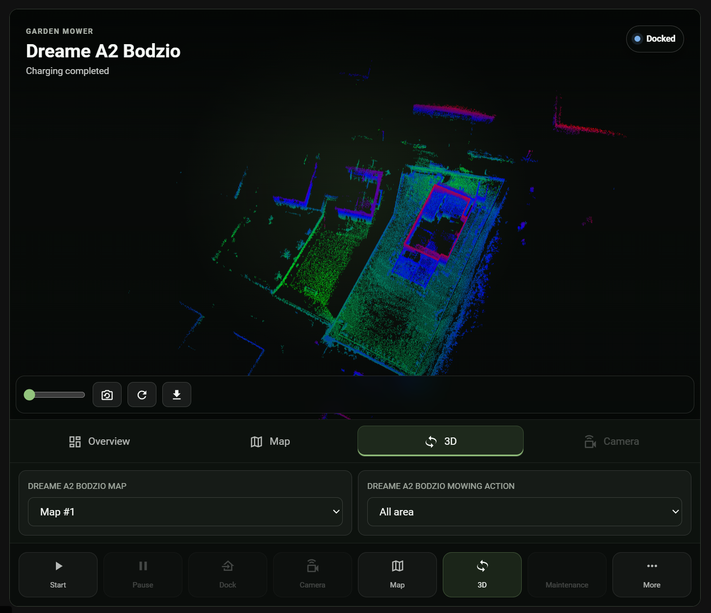

# Maps and 3D

[Back to the README](../README.md) · [Configuration](configuration.md)

Use the enabled **Map** camera for everyday dashboards. Choose the same camera
in Lawn Mower Card for the interactive view, and open **3D** only when you want
to load a point cloud. Map editing is not supported.

## Map cameras

The map camera uses the confirmed app-map JSON path first and falls back to the
vector source when it carries the active session. Both renderers use the same
palette, bundled Unicode font, path widths, and marker settings.

The primary `Map` camera is enabled by default and follows the current mowing
session, including the mower position and live path when the device reports
them. `Live Path Map`, `All Maps`, and `Map Diagnostics` remain optional,
disabled-by-default cameras for troubleshooting or specialized dashboards.

Locally rendered vector maps hide saved spot-mowing rectangles by default and
draw completed mowing passes subtly. This keeps the everyday map close to the
vendor app while preserving the live route and mower marker. The source spot
and path data remains available in map diagnostics.

Enabled map cameras warm their first image in the background during entity
startup. While a mowing session is active, coordinator updates also refresh the
map source without waiting for a browser request. An empty cache returns a loading
image while the download runs, keeping camera requests responsive. The camera returns the
last good JPEG for the same map immediately while a refresh runs. Switching maps
discards the previous lawn's image. Failed current-map downloads are retried once;
they do not silently substitute another saved map. Identical source images reuse
the existing JPEG conversion, and requested image sizes use a bounded cache of
resized JPEGs.

## Saved previews

Map images stay in memory by default. To keep a preview through a Home Assistant
restart, enable **Keep a map preview across restarts** in the integration options.
This stores one private JPEG, up to 2 MB, for at most 24 hours of reuse. It is
accepted only for the same mower, map, and presentation settings. The camera marks
it with `restart_preview: true` and a saved timestamp; it does not restore live
position or mission telemetry. The companion Lawn Mower Card labels it **Saved
preview** until a fresh map replaces it. Disabling the option removes the stored
preview.

Transient paths and positions are scoped to the selected map and mowing task.
Changing either clears the prior session trail. A mower position outside the
selected map boundary is retained in diagnostics but withheld from the image,
and persisted mower trail data is not presented as live while the session is
inactive.

## Interactive map

The primary map camera also exposes `mowing_map_api_path` for compatible versions
of [Lawn Mower Card](https://github.com/EvotecIT/lovelace-lawn-mower-card). This
read-only interface delivers the garden background separately from current
position and observed movement, so a moving marker does not require downloading
another full map image. The card can pan, zoom, fit the garden, and centre on a
fresh mower position while keeping battery and mission figures visible.

The interface requires the same read permission as the map camera. Geometry is
kept out of entity attributes and recorder state. A missing map identity or stale
position does not produce a live marker. Movement trails are not cut-area masks:
the interactive background omits historical mowing paths and decorative stripes
instead of presenting them as verified completed coverage.

## Appearance and rotation

Under **Settings → Devices & services → Dreame Lawn Mower → Configure**, choose
an Emerald, Mint, Dark, Midnight, or High contrast theme and adjust label, line, and
marker scale. **Saved spot area display** can hide spot rectangles, show only
their outlines, or restore the filled diagnostic overlay. **Completed mowing
path display** can hide previous passes, render them subtly, or show every pass
in full detail. These settings affect both app-map and vector-map rendering and
apply without reconnecting the integration. Scan-interval changes also apply
without a reload. Connection, video, and restart-preview options still reload
the integration when their values change.
Mint uses decorative stripes clipped to each lawn; the stripes do not indicate
mowing progress or direction. Connector paths remain open and are never filled
as extra lawns. Use **Selected Map Display Rotation** to store a different
rotation for each map, with upright labels in locally rendered maps and the
All Maps contact sheet. To use a custom mower marker, place a PNG, JPEG, or WebP
under `/config/www` and enter its relative path, such as
`mower/my-marker.png`. The integration ignores absolute paths, traversal,
unsupported types, files over 1 MB, and images larger than 512 by 512 pixels.

## Mission values after docking

The runtime mission progress, current-area, and total-area sensors also retain
the latest useful session values after mowing stops. While mowing they represent
live telemetry; after docking their attributes include `cached: true` and
`captured_at`. They become live again as soon as a new runtime session reports
metrics. This keeps dashboards useful without presenting an old mower position
or trail as current.

If the mower has multiple maps, enable the disabled `All Maps` camera to render
a contact sheet. Use `Map Diagnostics` when the map image is missing or when you
need source, counts, and parser evidence.

## 3D point clouds

The map camera also advertises a local `point_cloud_api_path` attribute. A
Home Assistant administrator can sign that path for a short-lived download.
For the active map, the integration first tries a stored LiDAR object whose map
index is confirmed by the app inventory or mower `OBJ` response. A mower with
exactly one created map may also reuse the vendor's `99.20` stored-object
announcement. That announcement has no map identity, so it is never reused on
a multi-map mower. If no safely attributed stored object is available, the
integration asks the mower to upload the selected app map, captures the new
announcement, and validates the returned PCD file. Firmware without the
announcement retains the older indexed-object lookup as a fallback. Responses
use short-lived private caching; forced refreshes use `private, no-store`.
Vendor filenames, cloud-signed URLs, and point coordinates are never written to
entity state or logs.

The companion
[Lawn Mower Card](https://github.com/EvotecIT/lovelace-lawn-mower-card) detects
this attribute and offers an on-demand 3D viewer. It does not generate or
download garden geometry during an ordinary dashboard render. Select the Hero
layout's **3D** tab or press **Load 3D map** in another layout when you want to
fetch it. Point-cloud access is currently restricted to Home Assistant admins.
A safely attributed stored file normally avoids mower generation; otherwise the
mower has up to 45 seconds to publish a fresh file. A failed request returns a
privacy-safe problem code and stage instead of exposing the vendor object name
or signed download URL.

This Dreame A2 view uses a real stored PCD from the integration, rendered by
Lawn Mower Card:

## Map controls and limits

Map controls include:

- a read-only `Map` camera for the active map
- a read-only `All Maps` contact sheet for quick map inventory
- a `Map` select that switches the mower's active map and refreshes the map,
  zone, spot, edge, and maintenance-point controls
- a `Selected Map Display Rotation` select that stores orientation per map
- `select` entities for mowing action, edge, zone, spot, and maintenance-point
  scope
- preference controls that follow either the selected map's global record or
  its selected custom zone
- a **Go to Maintenance Point** button when the selected map contains a point
  configured in the mower app
- services for switching the active mower map and starting explicit zone, spot,
  or edge jobs
- runtime live-track telemetry surfaced through sensors and map-camera attributes
- an admin-only, stored-or-fresh PCD point-cloud download for the selected app map
- circular and rotated rectangular forbidden areas rendered from their compact
  mower map representation

The mower acknowledges map-switch commands even when it ignores them during an
active, paused, or returning task. The integration blocks those states before
writing and does not change the selected map until `MAPL` confirms the requested
map index.

Interactive map editing is still intentionally out of scope for now:

- no-go editing
- virtual-wall editing
- zone geometry edits
- other direct map mutations
